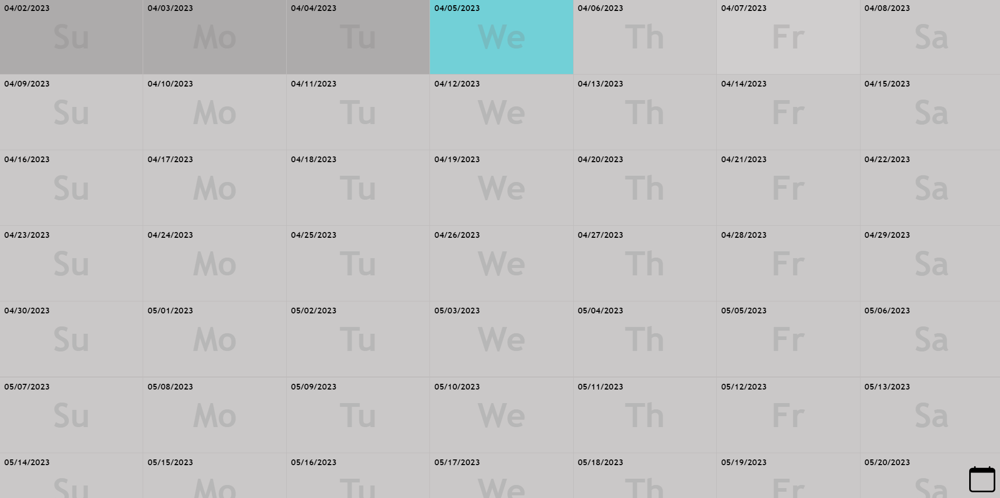

  
  # Event Planner

  ## Description

  I developed this event planner to fulfill the practical need of organizing my events. As my first React project, this app serves as a replacement for a weekly planner app I had created during the early months of my bootcamp experience. The event planner demonstrates my skills in animation and my ability to rapidly learn new technologies. Instead of building a full-stack application, I chose to store the state of events in local storage for a more streamlined approach.

  ## Table of Contents

  - [Installation](#installation)
  - [Usage](#usage)
  - [License](#license)
  - [Questions](#questions)

  ## Installation

  npm i - npm run dev

  ## Usage

  Just click the link [https://github.com/scicluna/eventplanner](https://github.com/scicluna/eventplanner)
  

  ## License

  This application is covered under the MIT license. Read more at [License: MIT](https://opensource.org/licenses/MIT)

  ## Questions

  1. Where can I find your github so that I can view your other projects? https://github.com/scicluna

  2. What email address should I use to contact you regarding further opportunities or questions? sciclunajl@gmail.com
